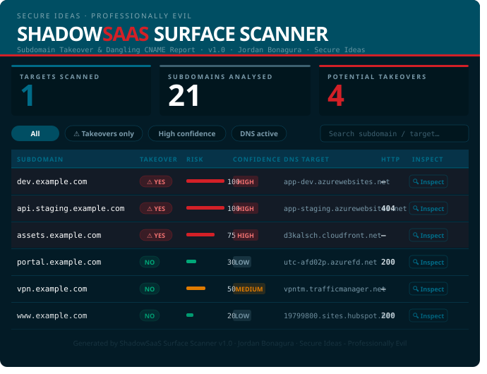

# ShadowSaaS Surface Scanner

**Subdomain Takeover & Dangling CNAME Detector**  
Author: [Jordan Bonagura](https://www.linkedin.com/in/jordan-bonagura) | [Secure Ideas - Professionally Evil](https://www.secureideas.com) | Version: 1.0

---

## HTML Report Preview



> Generated with `--html report.html --quiet`. Each row links to [web-check.xyz](https://web-check.xyz) for instant OSINT on the target subdomain.

---

## Overview

ShadowSaaS Surface Scanner enumerates subdomains and detects dangling or abandoned SaaS integrations by correlating DNS records, HTTP responses, and provider-specific fingerprints. Designed for authorized penetration tests and security assessments to identify subdomain takeover opportunities before attackers do.

A dangling CNAME occurs when a DNS record points to a hostname for a resource that has been deprovisioned or deleted, leaving it available for an attacker to claim. Once claimed, an attacker can host a service that appears to belong to the legitimate organization, enabling phishing, credential harvesting, CSP bypass, and cookie theft.

---

## Providers Covered

| Provider | Detection Method |
|---|---|
| Azure App Service | CNAME to `azurewebsites.net` + provider 404 body signature |
| Azure Traffic Manager | CNAME to `trafficmanager.net` + unreachable probe + non-HTTP detection |
| Azure Blob Storage | CNAME to `blob.core.windows.net` + storage error signature |
| Azure Static Apps | CNAME to `azurestaticapps.net` |
| Azure asverify | Derived CNAME — domain ownership verification records |
| AWS CloudFront | CNAME to `cloudfront.net` + deleted signature + active header check |
| GitHub Pages | A-record to GitHub IPs or CNAME to `github.io` |
| Heroku | HTTP body signature (`no such app`) |
| Vercel | HTTP headers + body signature |
| Netlify | HTTP headers + body signature |
| Shopify | HTTP headers |
| Firebase | HTTP headers + body signature (strict) |
| Cloudflare Pages | HTTP body signature (not claimable — informational) |

---

## Installation

**Requirements:** Python 3.8+

```bash
git clone https://github.com/ProfessionallyEvil/shadowsaas-surface-scanner.git
cd shadowsaas-surface-scanner
pip install -r requirements.txt
```

---

## Usage

```
python shadow_saas_surface.py [-h] [--file FILE] [--speculative] [--bruteforce]
                               [-o FILE] [--pretty] [--html FILE]
                               [--quiet] [--takeovers-only] [domain]
```

### Arguments

| Argument | Description |
|---|---|
| `domain` | Target domain or subdomain (e.g. `example.com` or `sub.example.com`) |
| `--file FILE`, `-f FILE` | Path to a file with one domain/subdomain per line |
| `--speculative` | Include subdomains from a built-in wordlist (login, auth, api, app, etc.) |
| `--bruteforce` | DNS brute-force against a built-in wordlist |
| `-o FILE`, `--output FILE` | Write JSON results to a file instead of stdout |
| `--pretty` | Pretty-print JSON output |
| `--html FILE` | Generate a self-contained HTML report |
| `--quiet` | Suppress JSON stdout — useful when using `--html` or `-o` |
| `--takeovers-only` | Only include results where `takeover_possible` is true |
| `-h`, `--help` | Show help message |

### Examples

```bash
# Enumerate a root domain via CT logs
python shadow_saas_surface.py example.com

# Analyse a single subdomain directly
python shadow_saas_surface.py staging.example.com

# Read multiple targets from a file
python shadow_saas_surface.py --file targets.txt

# Full scan with speculative wordlist and brute-force
python shadow_saas_surface.py example.com --speculative --bruteforce

# Save results as JSON
python shadow_saas_surface.py example.com -o results.json --pretty

# Generate HTML report only (no JSON printed to terminal)
python shadow_saas_surface.py example.com --html report.html --quiet

# JSON + HTML simultaneously, suppress terminal output
python shadow_saas_surface.py example.com -o results.json --html report.html --quiet

# Only show takeover findings in output
python shadow_saas_surface.py example.com --takeovers-only --html report.html --quiet

# Scan a file of targets and save both formats
python shadow_saas_surface.py --file targets.txt -o results.json --html report.html --quiet
```

### File Format (`targets.txt`)

```
example.com
staging.example.com
# Lines starting with # are treated as comments and skipped
another.com
```

---

## Detection Modes

### CT Log Enumeration (default)
Queries Certificate Transparency logs to discover subdomains. Uses a cascade of three sources — if one fails or is blocked, the next is tried automatically:

1. **crt.sh** — most comprehensive, may block datacenter IPs
2. **certspotter** — Sectigo CT aggregator, free tier, no key required
3. **hackertarget** — free tier with daily request limits, no key required

### Direct Mode
When given a subdomain with two or more dots (e.g. `staging.example.com`), analyses that specific subdomain directly instead of enumerating.

### Speculative Mode (`--speculative`)
Adds a built-in wordlist of common subdomain names. Useful when CT logs return no results.

### Brute-Force Mode (`--bruteforce`)
DNS brute-force against a built-in wordlist. Slower but finds subdomains not indexed in CT logs.

### asverify Derivation (automatic)
After the first analysis pass, automatically derives `asverify.<subdomain>` candidates for every confirmed Azure subdomain. These records never appear in CT logs.

---

## Output

### JSON (`-o` / `--pretty`)

```json
{
  "summary": {
    "total_subdomains": 42,
    "potential_takeovers": 3,
    "targets_scanned": 1
  },
  "results": [
    {
      "subdomain": "dev.example.com",
      "source": "ct_log",
      "dns_active": true,
      "dns_target": "app-example-dev.azurewebsites.net",
      "saas": "azure_app_service",
      "http_status": null,
      "risk_score": 90,
      "takeover_possible": true,
      "confidence": "high",
      "analysis": [
        "Azure App Service CNAME detected",
        "Azure app unreachable (probe failed) - possible orphaned app",
        "DNS active pointing to SaaS",
        "Critical subdomain name"
      ]
    }
  ]
}
```

### HTML (`--html`)
Generates a self-contained branded report with:
- Risk score bars, confidence badges, and takeover indicators
- Filter buttons (All / Takeovers only / High confidence / DNS active)
- Live search across subdomains and targets
- **Inspect** button per row linking to [web-check.xyz](https://web-check.xyz) for instant OSINT (DNS, headers, certificate, screenshot, ports)

### Output Fields

| Field | Description |
|---|---|
| `subdomain` | The subdomain analysed |
| `source` | How it was discovered (`ct_log`, `dns_bruteforce`, `wordlist`, `asverify_derived`, `direct_input`) |
| `dns_active` | Whether the subdomain resolves in DNS |
| `dns_target` | The resolved A record IP or CNAME target |
| `saas` | Detected SaaS provider, or `null` |
| `http_status` | HTTP status code from the probe, or `null` if unreachable |
| `risk_score` | Integer 0–100 indicating overall risk |
| `takeover_possible` | `true` if a takeover is assessed as possible |
| `confidence` | `high`, `medium`, `low`, or `speculative` |
| `analysis` | List of human-readable reasons supporting the assessment |

### Risk Score Reference

| Score | Meaning |
|---|---|
| 20 | Baseline — no indicators |
| 30–40 | Minor signal (critical subdomain name, CDN detected) |
| 50–60 | DNS active pointing to SaaS provider |
| 70–100 | Takeover indicators confirmed |

---

## False Positive Guidance

**Azure App Service 403** — HTTP 403 means the app exists and is responding with access denied. Not a takeover.

**Azure App Service 404** — Generic 404 from a live app is not a takeover. The tool only flags Azure takeovers when the response body contains Azure's specific "app not found" signatures, or when the probe fails entirely.

**AWS CloudFront 403** — Active distributions always inject `x-cache` and `x-amz-cf-id` headers even on 403 responses. The tool checks for the absence of these headers before confirming a takeover, eliminating false positives from WAF/geo-restriction/signed URL blocks.

**AWS CloudFront 404** — CloudFront distribution IDs are unique and never reused by AWS. A 404 from an active distribution is not a takeover.

**Azure Traffic Manager with non-HTTP protocol** — Endpoints fronting LDAP, SMTP, VPN, or other non-HTTP services will not respond to HTTP probes. The tool checks for non-HTTP indicators in the subdomain name and DNS target before flagging these as orphaned.

---

## Legal Notice

This tool is intended for authorized security testing and research only. Use against systems without explicit written permission is illegal. The author assumes no liability for misuse.

---

## License

MIT License — see [LICENSE](LICENSE) for details.